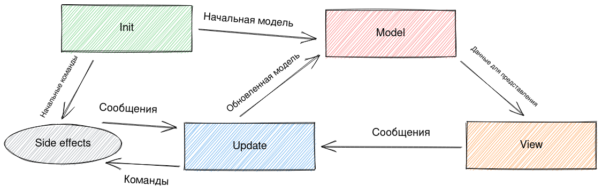
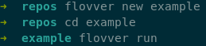
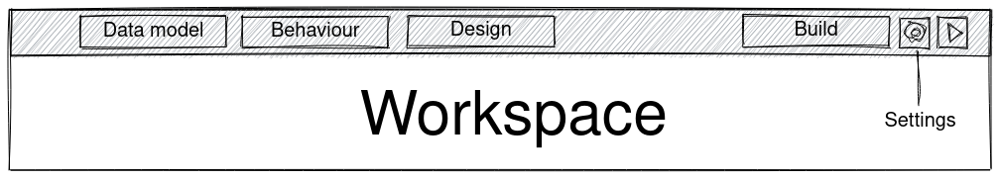
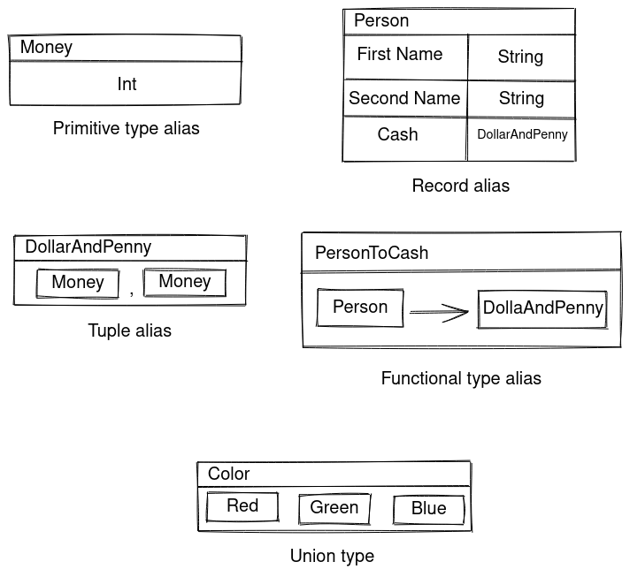

## Проектирование визуального функционального языка с возможностями оптимизации рекурсии

Для проектирования интерфейса приложений и прототипирования используют сервисы и редакторы вроде [Figma](https://figma.com), [Sketch](https://www.sketch.com/), [Adobe XD](https://www.adobe.com/products/xd.html). Продукты подобного плана предлагают развитые инструменты для вёрстки, однако в построении интерактивных прототипов их возможности ограничены - можно "забить" проигрывание анимации при нажатии на кнопку, не более того; получается продвинутая презентация в PowerPoint.

В качестве решения для быстрой разработки интерактивных прототипов предлагается визуальный язык функционального программирования. 

В общем случае, прикладной программист строит (программирует) поток данных, вычислительные узлы которого - чистые функции; узлы имеют n-ое количество входов (n - арность функции) и 1 выход; входы и выходы помечены типами, значения которых входят и выходят из вычислительного узла. Функции строго типизированы, то есть возможны только соединения входов и выходов, типы которых совпадают.

## Elm-архитектура

Предлагается построить предметно-ориентированный язык вокруг архитектуры Model-View-Update, также называемой Elm-архитектурой (в честь языка [Elm](https://elm-lang.org/), одного из первых, в котором шаблон [был формализован](https://guide.elm-lang.org/architecture/)).

Структурно Elm-архитектуру можно представить следующим образом:

* Сообщение - тип-сумма, значениями которого обмениваются блоки программы.
* Команда - сообщение, посылаемое блоку побочных эффектов (HTTP-запросы, случайные числа и т.д.).
* __Model__ - описание данных программы. Просто тип данных - примитивный или составной (в Elm это [записи](https://elm-lang.org/docs/records), основанные на работе [Extensible records with scoped labels](https://www.microsoft.com/en-us/research/publication/extensible-records-with-scoped-labels/?from=http%3A%2F%2Fresearch.microsoft.com%2Fpubs%2F65409%2Fscopedlabels.pdf)).
* __View__ - отображение данных, представляется как чистая функция `Model -> (DOM, Message)`. Принимает модель из источника, строит и отображает документ. Если с документом совершено какое-либо пользовательское действие (нажали на кнопку, набрали текст в поле ввода), порождает сообщение, которое отправится в __Update__.
* __Update__ - функция `Model -> Message -> (Model, Command)`, преобразующая модель и порождающая команды  для блока побочных эффектов по полученным сообщениям.
* __Init__ - "конструктор" модели - создает первую версию модели и порождает первые команды блоку побочных эффектов.

Цикл жизни программы, построенной с использованием Elm-архитектуры:

1. Функция __Init__ порождает модель, которая отображается функцией представления __View__.
2. При наступлении пользовательского события __View__ посылает сообщение на обновление модели __Update__.
3. __Update__ создает новую модель в соответствии с сообщением и посылает на отображение __View__. `GOTO 1`

Работа с побочными эффектами осуществляется следующим образом:
1. При наступлении пользовательского события __View__ посылает сообщение на порождение команды __Update__.
2. __Update__ порождает команду для блока побочных эффектов.
3. _Волшебным образом_ происходит обработка побочного эффекта, результат посылается в __Update__ сообщением.
4. __Update__ строит новую модель и передает __View__. `GOTO 1`

Предлагается представить каждый элемент архитектуры с учётом специфики проекта.

## Структура рабочего пространства
Работа с языком начинается с создания проекта с помощью интерфейса командной строки:

* `flovver new example` создает проект `example` в одноименной папке.
* `flovver run` запускает языковой сервер, создает сессию редактора и открывает вкладку браузера с рабочим пространством проекта.

Рабочее пространство представлено следующим образом:

* Вкладки Data Model, Behaviour, Design - представления компонентов Elm-архитектуры.
* __Build__ - кнопка сборки, при нажатии проект собирается в единый бандл.
* __Settings__ - окно конфигурации проекта (автор, название проекта, лицензия и т.д.).
* __Run__ - кнопка запуска, при нажатии проект собирается и открывается в новой вкладке браузера. Можно поддержать инкрементальную компиляцию и горячую замену кода, чтобы при пересборке проекта изменялась одна открытая страница, но это, конечно, не самое приоритетное.

## Model и Message
Задание пользовательских типов предлагается вынести во вкладку Data model.

Предполагается два вида пользовательских типов:

* Псевдонимы типов. Псевдоним можно создать для:
    - примитивных типов (число, строка);
    - кортежей;
    - записей;
    - функциональных типов.
* Типы-суммы. Пример: `Maybe a = Just a | Nothing`.

> Необходимо уточнить систему типов и по возможности урезать до минимального множества, достаточного для демонстрации работы системы.

Определения типов имеют визуальное представление (предварительный вариант):

Один произвольный тип во вкладке необходимо назначить моделью приложения. Он будет выступать аналогом Model в Elm-архитектуре. __Модель по умолчанию - пустой тип__ `()`.

Также необходимо назначить тип сообщений, которыми обмениваются компоненты системы.

## Update и Init

## View

## Формальное описание языка

## Расширение архитектуры для разработки серверных приложений

## Поддержка бессерверных вычислений

## Технические особенности

## Пример для демонстрации работы системы